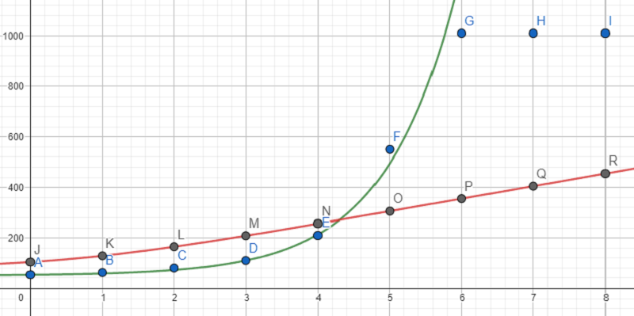

# Firmware

### How this works
The [Arduino Joystick Library](https://github.com/MHeironimus/ArduinoJoystickLibrary) allows an **ATMega32u4** board to be recognized by the PC as a PC Joystick, and providas an API that allows the Joystick buttons and axes to be pressed and moved from the board. Pedals potentiometers values come from the pedals cables to the analog inputs, and the firmware constrains and maps this values to the library acceptable ranges. 

### Potentiometer linearization
Since the potentiometers are logarithmic, their raw values vary logarithmically while pressing the pedals. To linearize them, the potentiometer curve must by measured and adjusted by some function. Applying the inverse of that function to the raw values will give linear readings.  

Taking 8 equally distant points form the pedal press range, the measured raw values are the following:
| Point  | Raw value |
| ------------- | ------------- |
| 0  | 53    |
| 1  | 62    |
| 2  | 80    |
| 3  | 110   |
| 4  | 210   |
| 5  | 550   |
| 6  | 1010  |
| 7  | 1010  |
| 8  | 1010  |  

Wich can be reasonably adjusted by the curve:  
`f(x) = 3e^x + 50`  

  

Applying the inverse of that function to the raw values gives a perfect linearization, but very out of scale:  
`f(x) = log(x - 50) - ln(3)`  

  

By correcting some constants, a better scaled linearization function can be defined:  
`f(x) = log(x - 45) * 50`  

  

The last one is the function that the firmwate actually uses. 

Another way to see the last function and it's constants meanings is the following:  
`linearizedValue = log(rawValue - minimumValue) * slope`  
Where:
-  `linearizedValue` is the value after the linearization
-  `rawValue` is the potentiometer raw reading
-  `minimumValue` is the raw value of the potentiometer when the pedal is not pressed (that's necessary to avoid taking the logarithm of a negative value)
-  `slope` is the slope of the linearized line (a higher value will give a better signal resolution, and a lower value will give lower aproximation errors)
